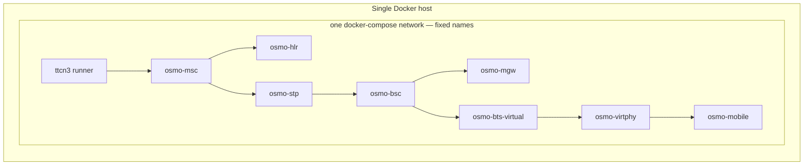
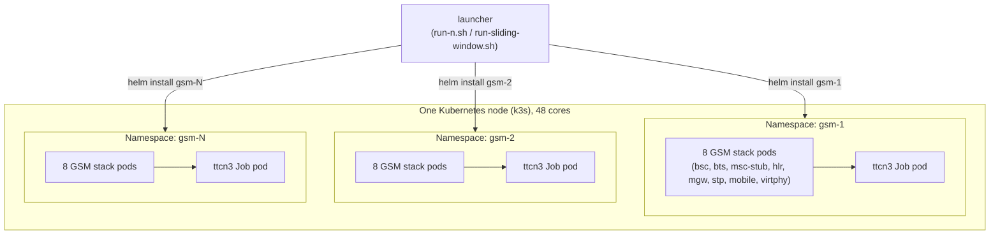
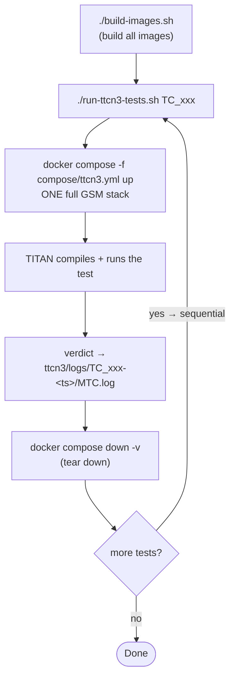
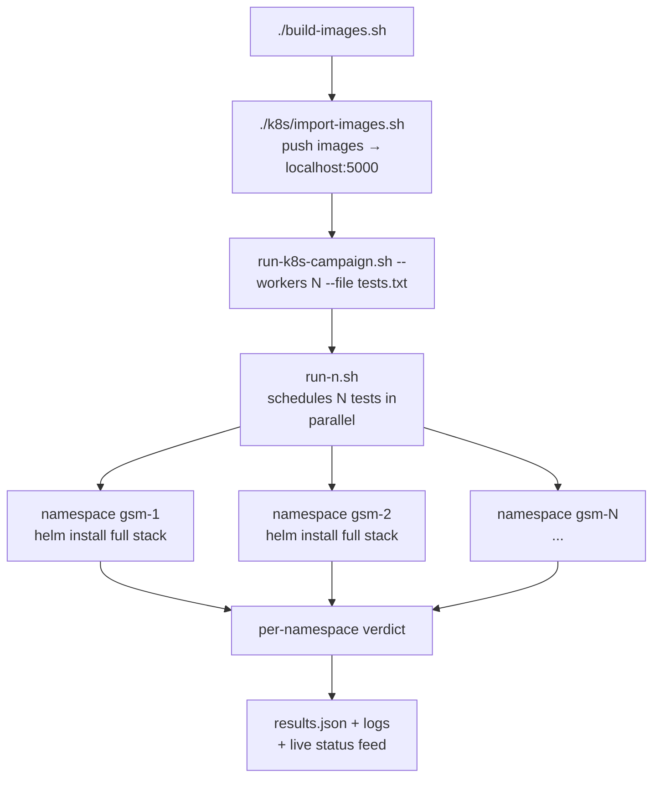
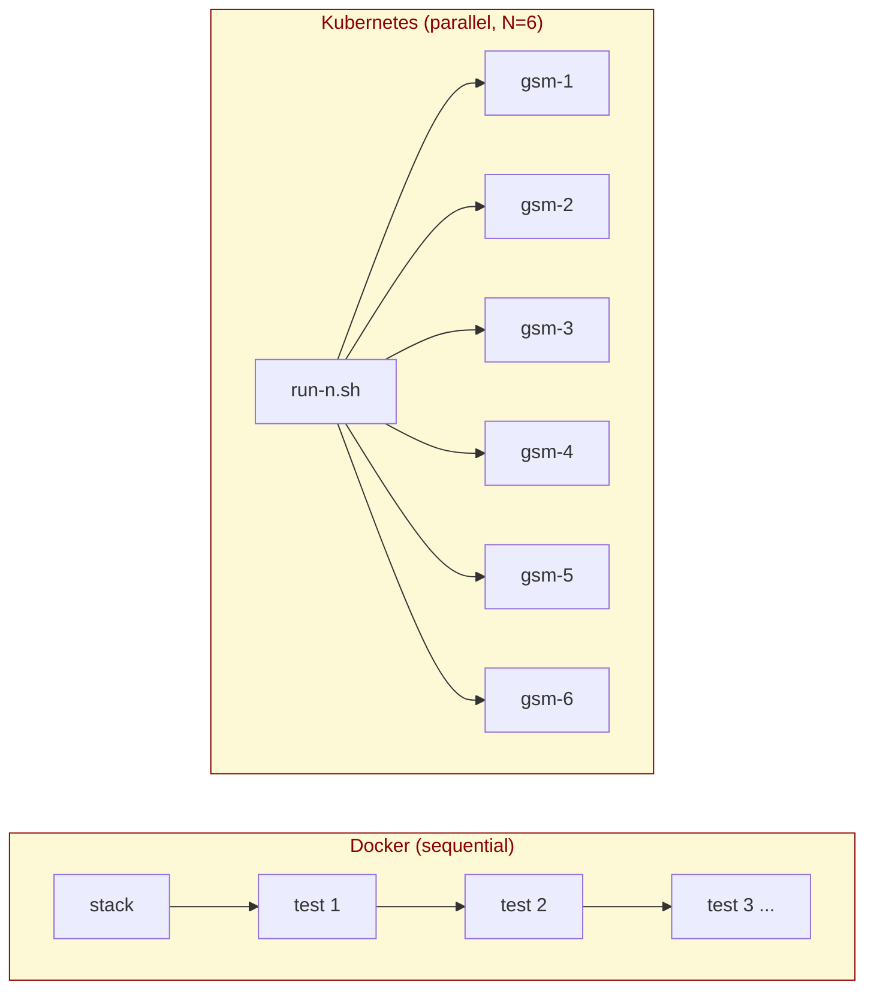
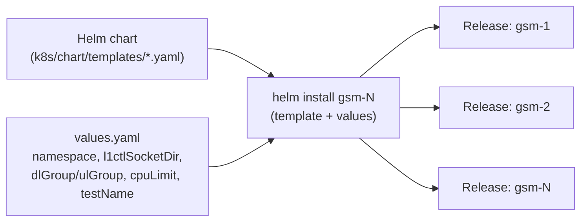

# Final Report — Scaling Osmocom + TTCN-3 with Kubernetes

## 1. The problem

The osmocom GSM test pipeline runs one test at a time. For every test, it:
1. Starts a full fake GSM network (BSC, BTS, MSC, HLR, MGW, STP + a fake mobile) in Docker containers.
2. Runs the TTCN-3 test.
3. Tears the whole network down.

Steps 1 and 3 (bring-up + teardown) take about **96 seconds**, no matter how short the test is. A short test like TC_26_2_3 only runs for 53 seconds — so more than half the time is wasted on setup/teardown, not testing.

**Idea:** the server has 48 CPU cores but each network instance barely uses any of them. So instead of running one network at a time, run many networks side by side — one per Kubernetes namespace — and split the test suite across them. This should make the whole suite finish much faster.

**Goal of the internship:** build this, and prove with real numbers how much faster it is, and where it stops getting faster.

## 2. What was built

| Week | What happened |
|---|---|
| 1 | Learned the stack, measured the baseline (docker-compose, one test at a time) |
| 2 | Got the same stack running on Kubernetes (k3s), one namespace, matching the baseline |
| 3 | Made the setup a Helm chart so any number of namespaces can be created from one template |
| 4 | Built the measurement tooling (timers, CPU/memory logging, plots); ran N = 1, 2, 4, 8 in parallel |
| 5 | Pushed N higher (up to 11), found the pod-count and CPU limits, ran a CPU-limit sweep, built the sliding-window dispatcher |
| 6 | Chased down bugs that only appeared when running in parallel; expanded the test list |
| 7 | Found and fixed a harness bug; started building a second batch of tests |
| 8 (this report) | Final report |

## 3. Core concepts learned

### Docker
- A **container** packages an app with everything it needs to run, isolated from the host.
- `docker compose` starts a group of containers together and wires up networking between them using service names as hostnames.
- Containers on the same compose network can reach each other by name (e.g. `osmo-stp:2905`), but that name resolution doesn't carry over into Kubernetes — this caused real bugs (see Section 12).

### Kubernetes
- **Pod** — the smallest deployable unit; one or more containers that share a network and storage.
- **Deployment** — keeps a set of pods running, restarting them if they crash.
- **Service** — a stable name/IP that routes to a set of pods, so pods can find each other by DNS even as they restart.
- **Namespace** — a way to run multiple independent copies of the same set of resources on one cluster without them clashing (each namespace gets its own DNS names, its own pods). This is the key feature the whole project relies on: **one namespace = one isolated GSM network**.
- **Job** — a pod that runs to completion (used to run the TTCN-3 test) instead of running forever like a normal service.
- **ConfigMap** — configuration files injected into pods without baking them into the image.
- **ResourceQuota / LimitRange** — caps how much CPU/memory a namespace (Quota) or a single container (LimitRange) is allowed to use.
- **Readiness/liveness probes** — health checks Kubernetes uses to decide if a pod is ready for traffic, or if it should be restarted. (These caused two of the bugs found in this project — see Section 12.)
- **Helm** — a templating tool for Kubernetes manifests. One "chart" + different values (namespace name, socket paths) can stamp out many identical, isolated copies of the stack. More on this in Section 9.

## 4. How the parallelism actually happened — Docker to Kubernetes

This is the core trick of the whole project, so it's worth walking through step by step.

### 4.1 Why docker-compose can't just be "run twice"

The original setup is one docker-compose network, with fixed container names, a fixed docker network, and a fixed host folder for the mobile's L1CTL socket:



If you tried to start this stack a second time on the same host, the second copy would try to create containers with the same names, bind the same docker network, and write to the same host folder as the first — it would either fail to start or silently corrupt the first copy's state. **docker-compose has no built-in idea of "isolated copy N of this stack."** Every name is shared and global to the host.

### 4.2 What Kubernetes namespaces give us for free

A Kubernetes **namespace** is a boundary that scopes names: a Service called `osmo-stp` in namespace `gsm-1` is a completely different object, with a completely different DNS name (`osmo-stp.gsm-1.svc.cluster.local`) and IP, than a Service called `osmo-stp` in namespace `gsm-2`. Same manifest, same names inside it — but Kubernetes keeps every namespace's copy separate automatically.



This namespace boundary is *why* the parallelism is possible at all: converting docker-compose to Kubernetes manifests (Week 2) plus wrapping them in a namespace-parameterized Helm chart (Week 3) turned "one fixed stack" into "a stack template that can be stamped out N times, side by side, on the same physical machine."

### 4.3 What still had to be fixed by hand

Kubernetes gives namespace isolation for DNS and pod IPs automatically, but a few things from the docker-compose days were **not** namespace-aware out of the box, and had to be explicitly parameterized per namespace before parallel runs actually worked cleanly:

| Leftover single-instance assumption | Fix |
|---|---|
| The mobile's L1CTL Unix socket was written to one fixed host folder (`/tmp/osmocom-l2`) | Rewritten per namespace: `/tmp/osmocom-l2-<namespace>` |
| The fake radio (GSMTAP) used one fixed multicast group for every instance | Each namespace derives its own multicast group from its namespace number |
| A CPU quota template divided the namespace limit by a hardcoded container count | Fixed to match the real per-namespace pod count |

Once these were parameterized per namespace (alongside the namespace name itself), N fully isolated copies of the stack could run at the same time without stepping on each other — which is what actually produces the speed-up numbers in Section 10.

## 5. How a Docker run works



## 6. How a Kubernetes run works



*Each namespace is an independent, isolated copy of the whole GSM stack (deployed by the Helm chart in `k8s/chart/`), with its own GSMTAP multicast group so parallel tests don't interfere. When one test finishes, its namespace is torn down and the next test takes the slot.*

## 7. Docker vs Kubernetes — quick comparison



## 8. Why Kubernetes for large scale

Compared to just running more docker-compose stacks by hand, Kubernetes gives several things this project relied on directly:

1. **Namespace isolation, for free.** As shown above, N independent copies of the same stack can exist on one host without manually renaming every container, network, and volume path — Kubernetes handles the DNS/IP scoping automatically. Doing the equivalent in plain docker-compose would mean hand-managing unique project names, container names, networks, and host paths for every one of the N copies — fragile and easy to get wrong.
2. **A built-in scheduler.** Kubernetes decides which physical resources each pod gets and packs pods onto the node automatically. Nobody had to manually figure out "which containers can share this core."
3. **Declarative, repeatable setup.** The whole stack is described in YAML/Helm templates. Bringing up (or tearing down) a namespace is one command, and it produces the same result every time — this is what makes the speed-up numbers in this report reproducible.
4. **Resource controls per tenant.** `ResourceQuota` and `LimitRange` let many parallel copies safely share one host without one namespace starving the others of CPU (Section 13). Docker-compose has no equivalent per-project quota system.
5. **Self-healing.** A crashed pod is restarted automatically by its Deployment. (This cuts both ways here — two of the bugs in Section 12 were caused by a *health check itself* being wrong, not by the crash-recovery idea being bad.)
6. **A natural fit for "run to completion" work.** Kubernetes' `Job` primitive is built exactly for one-shot work like a TTCN-3 test run, as opposed to `Deployment`, which is built for long-running services.
7. **Room to grow.** Nothing here is single-node-specific by design — the same namespace + Helm chart approach would extend to a multi-node cluster if the server ever needed to grow beyond 48 cores (explicitly out of scope for this internship, but a natural next step).

## 9. Helm charts and how they enabled the scaling

**What Helm is:** a templating tool for Kubernetes manifests. A "chart" is a set of YAML templates with placeholders; a set of "values" fills in those placeholders. `helm install <release-name> <chart> --set key=value` renders the templates and applies them to the cluster in one step.

**Before Helm (Week 2):** the single-namespace setup worked by running `sed` substitutions over raw YAML files to swap in a namespace name. This worked for one namespace, but every new thing that needed to vary per namespace (a socket path, a multicast group, a CPU limit) meant writing another fragile string-replacement pass in the launcher script.

**After Helm (Week 3 onward):** the manifests became a chart, and everything that needs to differ per copy of the stack became a named value:



This is what turned "one namespace, wired up by hand" into "N namespaces on demand": the launcher scripts (`run-n.sh`, `run-sliding-window.sh`) just call `helm install`/`helm uninstall` in a loop, once per namespace, and Helm guarantees every copy is built from the same template and stays internally consistent. Every new isolation fix found during the project (per-namespace socket path, per-namespace GSMTAP group, the CPU `ResourceQuota`/`LimitRange` pair) was added as one more chart value rather than another one-off script hack — so the chart is now the single source of truth for "what does one isolated instance of this stack look like," and scaling to a new N is just calling it more times.

## 10. The speed-up numbers

**Definitions used throughout:**
- `T_suite(N)` — wall-clock time for the whole run at N parallel namespaces.
- **Speed-up** `S(N) = T_suite(1) / T_suite(N)` — how many times faster than running one at a time.
- **Efficiency** `E(N) = S(N) / N` — how close to "perfectly linear" the speed-up is. 1.0 = perfect; lower = some time is wasted.

### Main result (Week 4 matrix, 8 tests, 3 repeats each)

Baseline `T_suite(1) = 1268.3 s`.

| N | T_suite (median) | S(N) | E(N) |
|---|---|---|---|
| 1 | 1268.3 s | 1.00× | 1.00 |
| 2 | 496.8 s | 2.55× | 1.28 |
| 4 | 312.0 s | 4.07× | 1.02 |
| 8 | 168.5 s | 7.53× | 0.94 |

Scaling stayed close to linear all the way to N=8 (94% efficient). N=2 looks "better than linear" (2.55× instead of 2×) — that's real, not a mistake: with only 1 namespace, a test-runner component (the MSC stub) built up state over many sequential tests and got slower/crashier the longer it ran. Splitting the same tests across 2 namespaces reset that state more often, so each test ran faster on top of the normal parallel speed-up.

### Pushing further (Week 5, 16 tests, sliding-window dispatch)

| | N=1 | N=8 | N=11 |
|---|---|---|---|
| T_suite | 4211 s | 766 s | 731 s |
| S(N) | 1.00× | 5.50× | 5.76× |
| E(N) | 1.00 | 68.7% | 52.4% |

Efficiency drops as N grows because one test (TC_26_6_1_1, ~412 s) is much longer than the rest. No matter how many namespaces run in parallel, the suite can't finish before that one test does — adding more workers past N=8 barely helps, since they just sit idle waiting for the slow test. (This is Amdahl's Law: a long serial "tail" caps how much parallelism can help.)

### Why N stopped at 11

Kubernetes has a hard limit of **110 pods per node**. Each namespace uses 9 pods (8 GSM stack containers + 1 test-runner pod), and ~5 pods are always running for system/cluster use.

```
Safe max N = floor((110 − 5) / 9) = 11
```

N=12 needs 113 pods — over the limit. It caused pods to get stuck "Pending" and one test failed that normally passes, consistent with pods waiting for a scheduling slot rather than a real test bug. **N=11 was confirmed as the safe ceiling** for this server.

## 11. Sliding-window scheduling (instead of static/smart sharding)

The plan originally called for **round-robin sharding** first (split tests evenly across N namespaces up front), then **smart sharding** later — sort tests by known duration and pack them so each namespace gets roughly equal total work (longest-processing-time-first, "LPT" bin packing).

Both of these are **static**: the split is decided before any test runs. That has a real weakness — if one namespace gets unlucky and is handed the two longest tests, it becomes the bottleneck while every other namespace finishes early and sits idle. LPT reduces this risk by planning ahead, but it still needs accurate duration estimates up front, and it still can't react to a namespace running slower than expected mid-run.

**What was built instead: a sliding-window dispatcher** (`scripts/run-sliding-window.sh`). Instead of pre-assigning tests, it keeps a pool of N "slots" always busy: as soon as any slot finishes its test, it immediately grabs the *next* unclaimed test from a shared queue. No test sits idle waiting for its pre-assigned slot, and no slot sits idle waiting for its pre-assigned list to run out — every slot pulls new work the moment it's free. This gets the packing benefit of LPT (nothing bottlenecks on a bad up-front guess) without needing any duration estimates at all.

**How it avoids two namespaces grabbing the same test — the mutex lock:**

All N slots read from one shared queue file. To stop a race where two slots could read the same "next" test at the same instant, the queue pop is wrapped in a **file lock (`flock`)**, used as a mutex:

```
flock -x QUEUE_LOCK   →  lock()   — a slot blocks here if another slot is mid-pop
read + remove one line from the queue file   →  the exclusive section
(subshell exits, lock file descriptor closes)   →  unlock()
```

If two slots finish at the same moment and both try to claim the next test, one gets the lock first and pops its test; the second one simply waits (blocked by the lock) until the first is done, then pops the *next* line — so it's mathematically impossible for two slots to claim the same test. This is exactly the classic mutex pattern (lock → critical section → unlock), just implemented with a file lock instead of an in-memory one, which works fine across separate shell processes.

**Result:** the sliding window kept all 11 namespaces continuously busy on the 16-test suite and reached 5.76× speed-up at N=11 — matching what LPT sharding aims for, but without ever needing to know test durations ahead of time, and with worst-case idle time only ever as large as one slot waiting briefly on a lock, not an entire namespace sitting idle for a whole run.

## 12. Bugs found (parallelism surfaced real bugs, not just resource limits)

Running many copies of the same network side-by-side exposed problems that never showed up running one at a time:

1. **DNS race** — a test-runner component tried to connect to another service before Kubernetes DNS was ready, causing crashes and restarts. Fixed with an init container that waits for the dependency to be reachable first.
2. **Health-check killing a healthy process** — a liveness probe on the test stub was itself unstable and killed the stub mid-test. Fixed by swapping it for a simpler process check. This happened **twice** (once in Week 4, again in Week 6) — health probes were a recurring source of false failures.
3. **Shared radio channel across namespaces** — all namespaces were broadcasting fake radio signals on the same network channel, so one mobile's signal was picked up by another namespace's tower. Fixed by giving each namespace its own channel, derived from its namespace number.
4. **Boot-time race condition** — a background message got queued and then wrongly replayed to the first test that connected, throwing off the test's internal counters. Only showed up under certain timing, fixed with an explicit wait for that background message to clear first.
5. **Config name mismatch** — some test config files used a slightly different parameter name than what the code expected, so the code silently fell back to a hardcoded address that doesn't exist in Kubernetes. Fixed by renaming the parameter at deploy time.
6. **Stale script bug (Week 7)** — the parallel-run script was accidentally calling an old, outdated copy of a setup script instead of the fixed one, silently undoing earlier fixes. Lesson: when the same script exists in two places, one of them going stale is a standing risk.

**Common thread:** most of these bugs were invisible at N=1 and only appeared once multiple namespaces ran side by side. Scaling up doesn't just test resource limits — it also finds hidden shared-state bugs.

## 13. CPU limits — the math

**Question:** how little CPU can we give each namespace and still have every test pass? Giving each namespace a hard cap matters because with no cap, one namespace can "steal" CPU from the others when all N are running at once.

**Method:** run all 8 (or 16) tests in parallel, sweep the CPU cap per namespace up and down, and find the smallest number where nothing fails.

Kubernetes settings used:
- **ResourceQuota** — total CPU allowed for the whole namespace.
- **LimitRange** — CPU allowed per individual container inside that namespace.
- Since each namespace has 9 containers, the per-container limit was computed as:

```
per-container limit = namespace limit ÷ 9   (some early runs mistakenly used ÷ 10 — this was found and fixed in commit 107696b)
```

### Result at N=8 (8 tests in parallel)

| CPU limit / namespace | Result |
|---|---|
| unconstrained | 427 s, 8/8 pass |
| 300 m | 546 s, 8/8 pass |
| **250 m** | **421 s, 8/8 pass — the sweet spot** |
| 225 m | 424 s, 6/8 pass — starts failing |
| 200 m | 562 s, 7/8 pass |
| 150 m | 439 s, 7/8 pass |
| 89 m | 1827 s, 0/8 pass — effectively broken |

("m" = millicores; 1000m = 1 full CPU core.)

**Conclusion:** 250m per namespace (≈25m per container) is the minimum safe value at N=8. Below 225m, pods get starved of CPU time by the OS scheduler (CFS throttling) and time-sensitive GSM steps (like a Location Update that must finish within 120 s) start missing their deadline and failing. **300m was recommended in practice**, as a safety margin above this edge.

### The limit is not fixed — it grows with N

At N=16, the same 250m limit was no longer enough:

| Total CPU budget (across 16 namespaces) | Pass rate | T_suite |
|---|---|---|
| 1 core | 0/13 | 567 s |
| 2 cores | 2/13 | 2090 s |
| 4 cores | 10/13 | 1018 s |
| 8 cores | 9/13 | 778 s |

More namespaces competing for the same 48 physical cores means each one needs more headroom, not less. **8 cores total (500m per namespace) was the recommended setting at N=16.**

### Simple takeaway

- CPU limit needed per namespace is not one fixed number — it depends on how many namespaces are running at once.
- Too little CPU doesn't just slow tests down — below a certain point it makes them fail outright, because GSM protocol timers expire while a starved pod waits for CPU time.
- There's a small band ("the elbow") between "just barely enough" and "clearly enough" — always leave a margin above it.

## 14. Recommendations

1. **Use N=11 as the default parallelism** on this 48-core / 110-pod-limit server, with a CPU limit around **300m per namespace** for 8-test batches, scaled up (e.g. 500m+) as N grows.
