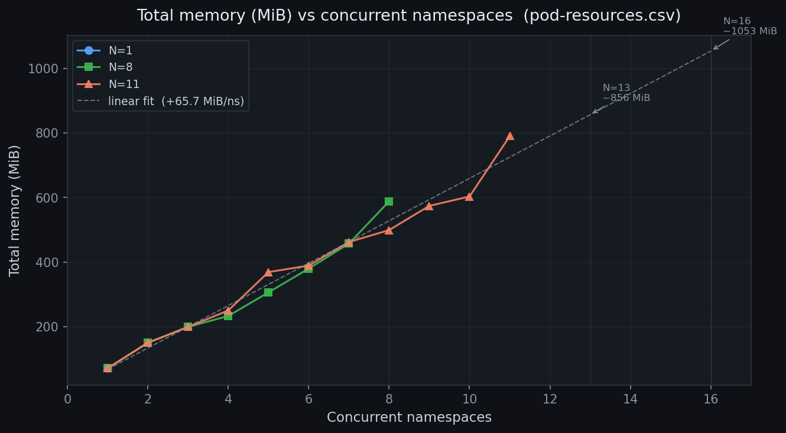
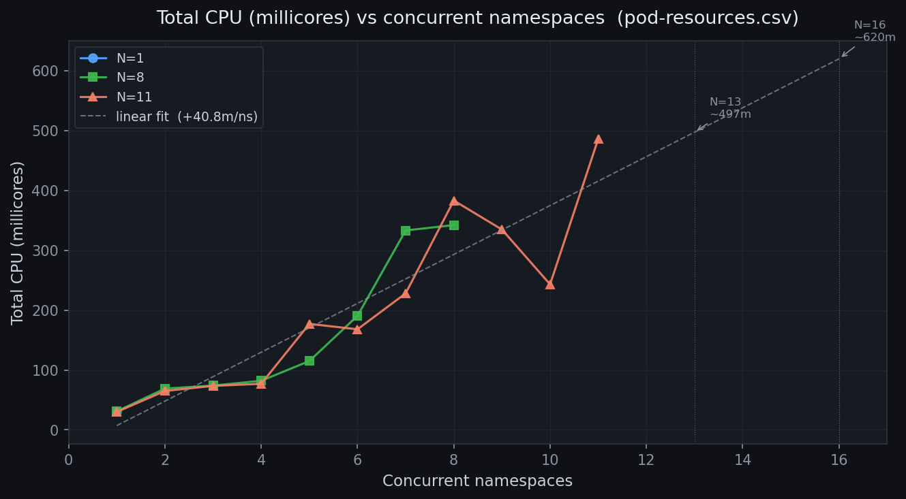

# Week 05 — Sliding Window Parallelism Experiment

## Setup

- **Test suite**: 16 confirmed-passing tests from `scripts/sliding-window-campaign.cfg`
- **Runner**: `scripts/run-sliding-window.sh` (true dynamic dispatch, flock-based queue)
- **Serial baseline**: `scripts/run-n.sh --workers 1` (N=1, one test at a time, fresh namespace each)
- **Parallel runs**: N=8 and N=11 sliding window

---

## Results

T_suite is defined per metrics.md: `max(t_teardown) - min(t0)` from events.csv
(full lifecycle — bringup + testing + teardown).

| | Serial (N=1) | Sliding Window (N=8) | Sliding Window (N=11) | Sliding Window (N=12) |
|---|---|---|---|---|
| Run directory | `run20260623-073129-N1` | `run20260623-071306-N8` | `run20260623-105203-N11` | `run20260624-063610-N12` |
| T_suite | 4210.927 s | 765.817 s | 730.602 s | 723.629 s |
| Wall clock (script start → finish) | 4211 s (70m 11s) | 766 s (12m 46s) | 731 s (12m 11s) | 724 s (12m 4s) |
| Pass / Fail | 15 / 1 | 16 / 0 | 16 / 0 | **14 / 2** |
| Speedup S(N) | — | **5.50×** | **5.76×** | 5.82× |
| Parallel efficiency E(N) | — | **68.7%** | **52.4%** | 48.5% |

Speedup computed as T_suite(1) / T_suite(N). Baseline = 4210.927 s (run20260623-073129-N1).

### Maximum safe N

The k8s node hard limit is 110 pods. Each test namespace peaks at 9 pods (8 stack + 1 TTCN-3 job pod); ~5 system pods are always present. Safe max N = floor((110 − 5) / 9) = **11**. N=12 requires 113 pods, briefly stalled with 3 Pending TTCN-3 pods, and produced 2 failures:

- **TC_26_6_2_3_1** — known flaky test (LU timeout, fails in serial too)
- **TC_26_7_2_1** — new failure at N=12 (ran for 160s vs 96–97s at N=8/N=11, likely delayed by pod scheduling stall)

TC_26_7_2_1 passing at N=8 and N=11 but failing at N=12 is consistent with CPU starvation caused by the pod limit stall. **N=11 is the confirmed safe maximum.**

---

### CPU resource isolation (LimitRange + ResourceQuota)

To bound per-namespace CPU consumption without kernel-level pinning, a `LimitRange` and `ResourceQuota` were applied via the Helm chart (`cpuLimit` value):

| Setting | Value | Derivation |
|---|---|---|
| `cpuLimit` | `370m` | 34m peak (osmo-bts-virtual) × 1.2 headroom × 9 pods |
| LimitRange per container | `41m` | 370m / 9 pods |
| ResourceQuota per namespace | `370m` | = `cpuLimit` |

Peak pod CPU from `pod-resources.csv` across N=1/8/11 runs: `osmo-bts-virtual` reached 34m, all other pods ≤ 14m.

**Validation run** (`run20260625-054317-N11`, N=11, `CPU_LIMIT=370m`):

| | N=11 (no limit) | N=11 (cpu-limit=370m) |
|---|---|---|
| Run directory | `run20260623-105203-N11` | `run20260625-054317-N11` |
| T_suite | 730.602 s | 773.861 s |
| Pass / Fail | 16 / 0 | **16 / 0** |
| Speedup S(11) | 5.76× | 5.44× |
| Parallel efficiency E(11) | 52.4% | 49.5% |

All 16 tests pass with the limit applied. The ~43s increase in T_suite (6%) is within run-to-run variance (no throttle events observed). The LimitRange divisor fix (10 → 9, commit `107696b` in `refs/osmocom-demo`) ensures the per-container value is computed correctly.

---

## Per-test durations

| Test | Serial (s) | Parallel (s) | Verdict (serial / parallel) |
|---|---|---|---|
| TC_26_6_1_1 | 412.0 | 411.5 | PASS / PASS |
| TC_34_2_2 | 334.3 | 333.6 | PASS / PASS |
| TC_26_7_3_2 | 230.9 | 230.7 | PASS / PASS |
| TC_26_6_2_3_1 | 75.3 | 210.4 | **FAIL** / PASS |
| TC_26_7_5_3 | 211.6 | 207.2 | PASS / PASS |
| TC_26_7_4_1 | 199.0 | 202.9 | PASS / PASS |
| TC_26_6_2_1_1 | 195.5 | 195.4 | PASS / PASS |
| TC_26_6_11_1 | 192.6 | 191.4 | PASS / PASS |
| TC_26_6_2_4 | 179.6 | 159.9 | PASS / PASS |
| TC_26_7_5_6 | 117.7 | 120.9 | PASS / PASS |
| TC_26_8_1_3_3_1 | 114.5 | 122.1 | PASS / PASS |
| TC_26_8_1_3_4_6 | 101.7 | 106.4 | PASS / PASS |
| TC_26_7_2_1 | 98.1 | 96.5 | PASS / PASS |
| TC_26_7_2_2 | 95.3 | 99.4 | PASS / PASS |
| TC_26_6_8_2 | 95.0 | 101.0 | PASS / PASS |
| TC_26_8_1_2_1_1 | 92.1 | 90.1 | PASS / PASS |

---

## Resource usage vs concurrency

Pod-level CPU and memory measured from `pod-resources.csv` (`kubectl top` per pod, 1 Hz).

Memory scales linearly (~65.7 MiB/namespace application RSS). CPU is bursty and less predictable.
Generated by `scripts/sliding-window-cpu-memory-plot-generator.py`.

---

## Key observations

1. **5.50× speedup at N=8, 5.76× at N=11**. Efficiency drops from 68.7% to 52.4% when
   moving from N=8 to N=11: the extra 3 slots barely reduce T_suite because TC_26_6_1_1
   (~412s) dominates the tail and most workers are already idle waiting for it to finish.
   Adding workers past N=8 hits Amdahl's wall — the serial bottleneck, not the worker count,
   sets the floor on T_suite.

2. **Bottleneck: TC_26_6_1_1 (412-417s)**. The longest test in the suite. Regardless of N,
   the run cannot finish until this test completes. With 16 tests total, going from N=8 to
   N=11 saves only ~35s (765 → 730s).

3. **TC_26_6_2_3_1 is flaky**. It failed in both serial runs (75s, early exit — LU timeout)
   but passed in all parallel runs (210-223s). The test VTY-cycles the mobile and waits up to
   30s for a Location Update Request; in a fresh namespace the mobile is quicker to register.
   Worth investigating separately.

4. **Individual test durations are consistent** across all runs (within ~5%) for all 15 stable
   tests, confirming the sliding window does not introduce interference between concurrent tests.
